# MachineNativeOps 綜合 CI/CD 實施指南

## 📋 實施總覽

本指南提供了完整的 MachineNativeOps 項目 CI/CD 實施方案，涵蓋 PR 衝突解決、自動化流水線、安全合規、監控觀測等所有關鍵組件。

## 🎯 核心目標

- ✅ **PR #958 合併衝突解決** - 自動化檢測、分析和解決流程
- ✅ **企業級 CI/CD 流水線** - 安全、高效、可擴展的自動化部署
- ✅ **多環境管理** - 標準化的開發、測試、生產環境配置
- ✅ **安全合規** - SLSA L3、NIST SP 800-204 標準實施
- ✅ **監控觀測** - 全方位的性能、健康狀態監控
- ✅ **災難恢復** - 自動回滾和應急響應機制

## 🚀 快速開始

### 1. 環境準備

```bash
# 克隆倉庫
git clone https://github.com/MachineNativeOps/machine-native-ops.git
cd machine-native-ops

# 安裝依賴工具
./scripts/install-dependencies.sh

# 配置環境變量
cp .env.example .env
# 編輯 .env 文件，配置必要的密鑰和 URL
```

### 2. 設置 GitHub Actions

```bash
# 添加必要的 Secrets
gh secret set GITHUB_TOKEN --body "$YOUR_GITHUB_TOKEN"
gh secret set COSIGN_PRIVATE_KEY --body "$YOUR_COSIGN_KEY"
gh secret set SONAR_TOKEN --body "$YOUR_SONAR_TOKEN"
gh secret set SLACK_WEBHOOK_URL --body "$YOUR_SLACK_WEBHOOK"
gh secret set KUBE_CONFIG_STAGING --file "$STAGING_KUBECONFIG"
gh secret set KUBE_CONFIG_PRODUCTION --file "$PRODUCTION_KUBECONFIG"
```

### 3. 部署基礎設施

```bash
# 安裝 ArgoCD
kubectl create namespace argocd
kubectl apply -f https://raw.githubusercontent.com/argoproj/argo-cd/stable/manifests/install.yaml

# 安裝監控組件
helm repo add prometheus-community https://prometheus-community.github.io/helm-charts
helm repo update
helm install monitoring prometheus-community/kube-prometheus-stack \
  --namespace monitoring --create-namespace

# 部署應用
helm upgrade --install machine-native-ops ./charts/machine-native-ops \
  --namespace staging --create-namespace \
  --values ./charts/machine-native-ops/values-staging.yaml
```

## 📁 項目結構

```
machine-native-ops/
├── .github/workflows/           # GitHub Actions 工作流
│   ├── ci-pipeline.yml         # 主 CI/CD 流水線
│   ├── security-scan.yml       # 安全掃描
│   ├── deploy-staging.yml      # 測試環境部署
│   ├── deploy-production.yml    # 生產環境部署
│   └── automerge-pr958.yml     # PR 自動合併
├── charts/                     # Helm Charts
│   └── machine-native-ops/
│       ├── Chart.yaml
│       ├── values.yaml         # 默認配置
│       ├── values-dev.yaml     # 開發環境
│       ├── values-staging.yaml  # 測試環境
│       └── values-prod.yaml    # 生產環境
├── kustomize/                  # Kustomize 配置
│   ├── base/
│   └── overlays/
├── scripts/                    # 自動化腳本
│   ├── pr958-merge-resolution.sh
│   ├── conflict-analyzer.py
│   ├── performance-test.sh
│   ├── emergency-rollback.sh
│   └── compliance-check.sh
├── monitoring/                 # 監控配置
│   ├── prometheus/
│   ├── grafana/
│   └── alerts/
└── docs/                      # 文檔
    ├── deployment-guide.md
    ├── security-policy.md
    └── troubleshooting.md
```

## 🔄 PR #958 衝突解決流程

### 自動化解決步驟

1. **觸發檢測**
   ```bash
   # 手動執行衝突分析
   ./conflict-analyzer.py
   
   # 或通過 GitHub Actions 自動觸發
   gh workflow run automerge-pr958.yml
   ```

2. **衝突分析**
   ```bash
   # 查看衝突分析報告
   cat PR958-conflict-resolution-report.md
   ```

3. **自動解決**
   ```bash
   # 執行自動解決腳本
   chmod +x pr958-merge-resolution.sh
   ./pr958-merge-resolution.sh
   ```

4. **驗證合併**
   ```bash
   # 運行測試套件
   npm test  # 或 make test
   
   # 推送到新分支
   git push origin auto-resolve-pr958
   
   # 創建 PR
   gh pr create --title "Auto-resolved conflicts for PR #958"
   ```

### 衝突解決策略

| 文件類型 | 解決策略 | 驗證方法 |
|---------|---------|---------|
| YAML 配置 | 保留 PR 版本，添加註釋 | helm lint |
| Python 代碼 | 智能合併函數 | pytest |
| 依賴文件 | 選擇更新版本 | pip check |
| 文檔文件 | 合併內容 | markdownlint |

## 🚀 CI/CD 流水線配置

### 流水線階段說明

```mermaid
graph LR
    A[代碼提交] --> B[質量檢查]
    B --> C[單元測試]
    C --> D[集成測試]
    D --> E[安全掃描]
    E --> F[構建鏡像]
    F --> G[簽名證書]
    G --> H[部署測試]
    H --> I[E2E 測試]
    I --> J[性能測試]
    J --> K[部署生產]
```



### 關鍵配置參數

```yaml
# .github/workflows/ci-pipeline.yml 關鍵配置
env:
  REGISTRY: ghcr.io
  IMAGE_NAME: ${{ github.repository }}
  COSIGN_PASSWORD: ${{ secrets.COSIGN_PWD }}

jobs:
  build-and-push:
    runs-on: ubuntu-latest
    steps:
      - name: Build and push
        uses: docker/build-push-action@v4
        with:
          push: true
          tags: ${{ steps.meta.outputs.tags }}
          platforms: linux/amd64,linux/arm64
```

## 🔒 安全合規實施

### SLSA L3 合規

```bash
# 生成 SLSA 證書
cosign attest \
  --predicate slsa-provenance.json \
  --type slsa \
  --key $COSIGN_KEY \
  $IMAGE_URI

# 驗證 SLSA 合規性
slsa-verifier verify-image $IMAGE_URI
```

### NIST SP 800-204 合規

```bash
# 執行合規檢查
./scripts/compliance-check.sh

# 查看合規報告
cat compliance-report-$(date +%Y%m%d).json
```

### 安全掃描配置

```yaml
# Trivy 掃描配置
trivy:
  image:
    scan:
      enabled: true
      severity: "CRITICAL,HIGH,MEDIUM"
  fs:
    scan:
      enabled: true
      path: "./"

# SonarQube 配置
sonar:
  projectKey: "machine-native-ops"
  sources: "src/"
  exclusions: "**/*_test.go,**/vendor/**"
```

## 📊 性能測試與監控

### 性能測試執行

```bash
# 執行性能測試
chmod +x scripts/performance-test.sh
./scripts/performance-test.sh \
  "https://staging.machine-native-ops.com" \
  100 \
  "15m" \
  "staging"

# 查看測試報告
open performance-report-*.html
```

### 監控指標配置

```yaml
# 關鍵性能指標 (KPI)
metrics:
  availability:
    target: 99.9%
    measurement: uptime_percentage
  
  response_time:
    p95_target: "500ms"
    p99_target: "1500ms"
  
  error_rate:
    target: "0.1%"
    measurement: http_requests_failed_rate
  
  throughput:
    target: "1000 req/s"
    measurement: requests_per_second
```

### Prometheus 規則

```yaml
# alerting rules
groups:
  - name: machine-native-ops
    rules:
      - alert: HighErrorRate
        expr: rate(http_requests_total{status=~"5.."}[5m]) > 0.01
        for: 2m
        
      - alert: HighResponseTime
        expr: histogram_quantile(0.95, http_request_duration_seconds) > 1
        for: 5m
```

## 🔄 多環境管理

### 環境配置對比

| 配置項 | 開發環境 | 測試環境 | 生產環境 |
|--------|---------|---------|---------|
| 副本數 | 1 | 2 | 3+ |
| 資源限制 | 500m CPU / 512Mi | 1000m CPU / 1Gi | 2000m CPU / 4Gi |
| 自動擴縮 | 關閉 | 啟用 | 啟用 |
| 健康檢查 | 基礎 | 標準 | 嚴格 |
| 監控 | 基礎 | 完整 | 全方位 |
| 安全 | 基礎 | 標準 | 最嚴格 |

### 環境部署命令

```bash
# 部署到開發環境
helm upgrade --install machine-native-ops-dev ./charts/machine-native-ops \
  --namespace dev --create-namespace \
  --values ./charts/machine-native-ops/values-dev.yaml

# 部署到測試環境
helm upgrade --install machine-native-ops-staging ./charts/machine-native-ops \
  --namespace staging --create-namespace \
  --values ./charts/machine-native-ops/values-staging.yaml

# 部署到生產環境
helm upgrade --install machine-native-ops-prod ./charts/machine-native-ops \
  --namespace production --create-namespace \
  --values ./charts/machine-native-ops/values-prod.yaml
```

## 🚨 災難恢復程序

### 緊急回滾流程

```bash
# 自動緊急回滾
chmod +x scripts/emergency-rollback.sh
./scripts/emergency-rollback.sh \
  production \
  machine-native-ops \
  "https://machine-native-ops.com/health"

# 手動回滾
argocd app rollback machine-native-ops --revision <previous-revision>

# 驗證回滾
kubectl wait --for=condition=available --timeout=300s deployment/machine-native-ops -n production
curl -f https://machine-native-ops.com/health
```

### 備份與恢復

```bash
# 創建備份
./scripts/backup-restore.sh backup

# 恢復數據
./scripts/backup-restore.sh restore backup-20231201_020000.yaml
```

## 📈 性能基準與驗證

### 測試矩陣

| 測試類型 | 併發數 | 持續時間 | 成功標準 | 執行頻率 |
|---------|--------|---------|---------|---------|
| 單元測試 | N/A | <5分鐘 | 100% 通過 | 每次提交 |
| 集成測試 | 10 | 10分鐘 | 100% 通過 | 每日 |
| 壓力測試 | 100 | 15分鐘 | 錯誤率<5% | 週期性 |
| 耐力測試 | 50 | 2小時 | 錯誤率<1% | 週期性 |

### 驗證清單

```markdown
## 部署前檢查
- [ ] 代碼質量檢查通過
- [ ] 所有測試通過
- [ ] 安全掃描無高危漏洞
- [ ] 性能測試達標
- [ ] 配置文件驗證通過

## 部署後驗證
- [ ] 服務健康檢查通過
- [ ] 監控指標正常
- [ ] 日誌記錄正常
- [ ] 性能指標達標
- [ ] 用戶訪問正常
```

## 🔧 故障排除

### 常見問題

#### 1. 構建失敗
```bash
# 檢查構建日誌
gh run view --log

# 常見解決方案
# - 清理 Docker 緩存
docker system prune -a

# - 檢查依賴版本
npm outdated
pip list --outdated
```

#### 2. 部署失敗
```bash
# 檢查 ArgoCD 狀態
argocd app get machine-native-ops
argocd app logs machine-native-ops

# 檢查 Kubernetes 資源
kubectl get events -n production
kubectl describe pod -l app=machine-native-ops -n production
```

#### 3. 性能問題
```bash
# 檢查資源使用
kubectl top pods -n production
kubectl top nodes

# 檢查應用指標
curl http://prometheus.local/api/v1/query?query=container_cpu_usage_seconds_total
```

### 調試命令

```bash
# 查看 CI/CD 流水線狀態
gh run list
gh run view <run-id>

# 檢查 Helm 部署
helm list -A
helm history machine-native-ops -n production

# 檢查 ArgoCD 同步
argocd app sync machine-native-ops --dry-run
argocd app diff machine-native-ops

# 監控系統狀態
kubectl get pods --all-namespaces
kubectl get events --sort-by='.lastTimestamp'
```

## 📚 培訓與文檔

### 團隊培訓要點

1. **CI/CD 流程理解**
   - 流水線各階段作用
   - 失敗處理流程
   - 緊急回滾程序

2. **安全合規要求**
   - SLSA 證書驗證
   - 安全掃描結果解讀
   - 合規報告生成

3. **監控運維**
   - Prometheus 指標理解
   - Grafana 儀表板使用
   - 告警處理流程

### 文檔維護

- **API 文檔** - 自動生成並發布
- **部署指南** - 持續更新最佳實踐
- **故障排除** - 收集常見問題和解決方案
- **性能基準** - 定期更新基準數據

## 🎯 持續改進

### 優化方向

1. **性能優化**
   - 構建時間優化
   - 部署速度提升
   - 資源使用優化

2. **安全增強**
   - 增加安全掃描覆蓋面
   - 實施零信任架構
   - 加強密鑰管理

3. **可觀測性**
   - 增加業務指標
   - 實施分佈式追蹤
   - 優化告警策略

### 度量指標

```yaml
# 改進目標
improvement_targets:
  build_time:
    current: "8m"
    target: "5m"
  
  deployment_time:
    current: "15m"
    target: "10m"
  
  test_coverage:
    current: "85%"
    target: "90%"
  
  security_scan_coverage:
    current: "95%"
    target: "100%"
```

---

## 📞 支持與聯繫

如有問題或需要支持：
1. 查看 GitHub Issues
2. 聯繫 DevOps 團隊
3. 查看內部知識庫
4. 參考故障排除文檔

**注意**: 本指南會隨著項目發展持續更新，請定期查看最新版本。