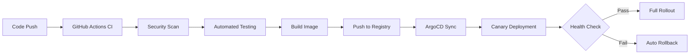

# MachineNativeOps CI/CD System

## Overview

This repository contains a comprehensive, enterprise-grade CI/CD implementation for the MachineNativeOps project. The system features automated deployments, canary releases, intelligent rollbacks, comprehensive monitoring, and disaster recovery capabilities.

## 🎯 Key Features

- **Automated CI/CD Pipeline** with GitHub Actions
- **Progressive Canary Deployments** using Argo Rollouts
- **Intelligent Rollback Mechanism** with automated failure detection
- **Comprehensive Monitoring** with Prometheus and Grafana
- **Security Compliance** (SLSA L3, NIST SP 800-204)
- **Automated Secrets Rotation** with audit logging
- **Team Training Tools** with drill simulations
- **Disaster Recovery** procedures and automation

## 📁 Project Structure

```
.
├── scripts/
│   ├── secrets_rotation.py          # Automated secret management
│   ├── rollback-mechanism.sh        # Intelligent rollback system
│   ├── drill-simulation.sh          # Team training drills
│   └── ci-cd-validation.sh          # System validation suite
│
├── charts/
│   ├── argo-rollout.yaml            # Canary deployment config
│   ├── analysis-template-success-rate.yaml
│   ├── analysis-template-error-rate.yaml
│   └── analysis-template-response-time.yaml
│
├── monitoring/
│   ├── grafana-dashboard.json       # Monitoring dashboard
│   ├── prometheus-alerts.yaml       # Alerting rules
│   └── setup-monitoring.sh          # Deployment script
│
├── docs/
│   ├── github-secrets-setup-guide.md
│   └── team-training-guide.md
│
├── IMPLEMENTATION_SUMMARY.md        # Complete implementation details
└── README.md                        # This file
```

## 🚀 Quick Start

### Prerequisites

- Kubernetes cluster (v1.24+)
- kubectl configured and authenticated
- Argo Rollouts installed
- GitHub CLI installed and authenticated
- Container registry access

### Installation

#### 1. Deploy Monitoring Stack
```bash
./monitoring/setup-monitoring.sh
```

#### 2. Configure GitHub Secrets
```bash
# Follow the comprehensive guide
cat docs/github-secrets-setup-guide.md
```

#### 3. Deploy Application
```bash
kubectl apply -f charts/argo-rollout.yaml
kubectl apply -f charts/analysis-template-*.yaml
```

#### 4. Validate Installation
```bash
./scripts/ci-cd-validation.sh all
```

#### 5. Access Dashboards
```bash
# Grafana
kubectl port-forward svc/grafana 3000:3000 -n monitoring
# URL: http://localhost:3000
# Username: admin / Password: admin

# Prometheus
kubectl port-forward svc/prometheus 9090:9090 -n monitoring
# URL: http://localhost:9090
```

## 📚 Documentation

### Core Documentation

- **[Implementation Summary](IMPLEMENTATION_SUMMARY.md)** - Complete system overview and implementation details
- **[Team Training Guide](docs/team-training-guide.md)** - Comprehensive training material and procedures
- **[GitHub Secrets Setup Guide](docs/github-secrets-setup-guide.md)** - Security configuration and best practices

### Script Documentation

#### Secrets Rotation
```bash
# Rotate all secrets
python3 scripts/secrets_rotation.py \
  --repo MachineNativeOps/machine-native-ops \
  --secret API_TOKEN

# Dry run to preview
python3 scripts/secrets_rotation.py \
  --repo MachineNativeOps/machine-native-ops \
  --secret API_TOKEN \
  --dry-run

# Verify rotation
python3 scripts/secrets_rotation.py \
  --repo MachineNativeOps/machine-native-ops \
  --secret API_TOKEN \
  --verify
```

#### Rollback Mechanism
```bash
# Monitor deployment and auto-rollback on failure
./scripts/rollback-mechanism.sh monitor

# Manual rollback
./scripts/rollback-mechanism.sh rollback "Performance degradation"

# Rollback to specific revision
./scripts/rollback-mechanism.sh manual-rollback 3

# List rollback points
./scripts/rollback-mechanism.sh list

# Check status
./scripts/rollback-mechanism.sh status

# Clean up old snapshots
./scripts/rollback-mechanism.sh cleanup
```

#### Drill Simulation
```bash
# Run all drill scenarios
./scripts/drill-simulation.sh all

# Run specific scenarios
./scripts/drill-simulation.sh pod-failure
./scripts/drill-simulation.sh high-latency
./scripts/drill-simulation.sh canary-failure
./scripts/drill-simulation.sh secret-rotation
./scripts/drill-simulation.sh resource-exhaustion
./scripts/drill-simulation.sh emergency-rollback
./scripts/drill-simulation.sh monitoring-alerts
```

#### Validation
```bash
# Run all validation tests
./scripts/ci-cd-validation.sh all

# Run specific test categories
./scripts/ci-cd-validation.sh infrastructure
./scripts/ci-cd-validation.sh deployment
./scripts/ci-cd-validation.sh rollouts
./scripts/ci-cd-validation.sh monitoring
./scripts/ci-cd-validation.sh scripts
./scripts/ci-cd-validation.sh docs
```

## 🔧 Operational Procedures

### Daily Operations
```bash
# Check deployment status
kubectl argo rollouts get machine-native-ops -n default

# Review monitoring dashboard
# Access: http://localhost:3000/d/machine-native-ops-cicd

# Check for alerts
kubectl get alerts -n monitoring
```

### Emergency Response
```bash
# Trigger immediate rollback
./scripts/rollback-mechanism.sh rollback "Critical incident"

# Monitor recovery
watch kubectl argo rollouts get machine-native-ops -n default

# Check logs
kubectl logs -n default -l app=machine-native-ops --tail=100
```

### Regular Maintenance
```bash
# Weekly: Clean up old snapshots
./scripts/rollback-mechanism.sh cleanup

# Weekly: Verify secrets
python3 scripts/secrets_rotation.py --verify

# Monthly: Run drill simulations
./scripts/drill-simulation.sh all
```

## 🎓 Training

### Team Training Exercises

1. **Deploy a Test Change**
   ```bash
   echo "Test deployment" > test.txt
   git add test.txt
   git commit -m "test: Verify deployment pipeline"
   git push origin feature/test-deployment
   gh pr create --title "Test deployment" --body "Testing deployment pipeline"
   ```

2. **Trigger and Monitor Rollback**
   ```bash
   kubectl argo rollouts set image machine-native-ops \
     machine-native-ops=nginx:broken -n default
   ./scripts/rollback-mechanism.sh rollback "Test rollback procedure"
   ```

3. **Run Drill Simulation**
   ```bash
   ./scripts/drill-simulation.sh all
   cat /var/log/drill-simulation.log
   ```

For comprehensive training, see [Team Training Guide](docs/team-training-guide.md).

## 🏗️ Architecture

### CI/CD Pipeline Flow


### Monitoring Stack
- **Prometheus**: Metrics collection and alerting
- **Grafana**: Real-time dashboards with 12 panels
- **AlertManager**: Alert routing and notifications

### Deployment Strategy
- **Progressive Canary**: 10% → 30% → 50% → 80% → 100%
- **Automated Analysis**: Success rate, error rate, response time
- **Intelligent Rollback**: Automatic failure detection and recovery

## 🔒 Security

### Compliance
- ✅ **SLSA L3**: Provenance generation and verification
- ✅ **NIST SP 800-204**: Security configuration and controls
- ✅ **SOC 2 Ready**: Control implementation for enterprise compliance

### Security Features
- Environment-isolated secrets
- Automated secret rotation (30-day cycle)
- Container image signing with Cosign
- SBOM generation and attestation
- Comprehensive audit logging

## 📊 Monitoring

### Key Metrics
- **Deployment Health**: Rollout phase, replica count
- **Application Metrics**: Success rate (≥95%), error rate (<1%), P95 response time (<500ms)
- **Resource Usage**: CPU, memory, network
- **Canary Analysis**: Traffic distribution, performance comparison

### Alerts
- **Critical Alerts**: Rollout degraded, high error rate, pod crash looping
- **Warning Alerts**: High CPU/memory usage, canary failure rate, high response time

## 🤝 Contributing

For contribution guidelines and development procedures, please refer to the [Team Training Guide](docs/team-training-guide.md).

## 📞 Support

### Resources
- **Documentation**: See `docs/` directory
- **Implementation Details**: [IMPLEMENTATION_SUMMARY.md](IMPLEMENTATION_SUMMARY.md)
- **External Resources**:
  - [Argo Rollouts](https://argoproj.github.io/argo-rollouts/)
  - [Prometheus](https://prometheus.io/docs/)
  - [Grafana](https://grafana.com/docs/)
  - [GitHub Actions](https://docs.github.com/actions/)

### Contact
- **On-Call Engineer**: Check rotation schedule
- **Engineering Team**: engineering@machinenativeops.com
- **DevOps Team**: devops@machinenativeops.com

## 📜 License

See LICENSE file for details.

## 🙏 Acknowledgments

Built with best practices from:
- Argo Project
- Prometheus Ecosystem
- CNCF Community
- DevOps Best Practices

---

**Status**: ✅ Production Ready  
**Implementation Date**: 2025  
**Version**: 1.0.0