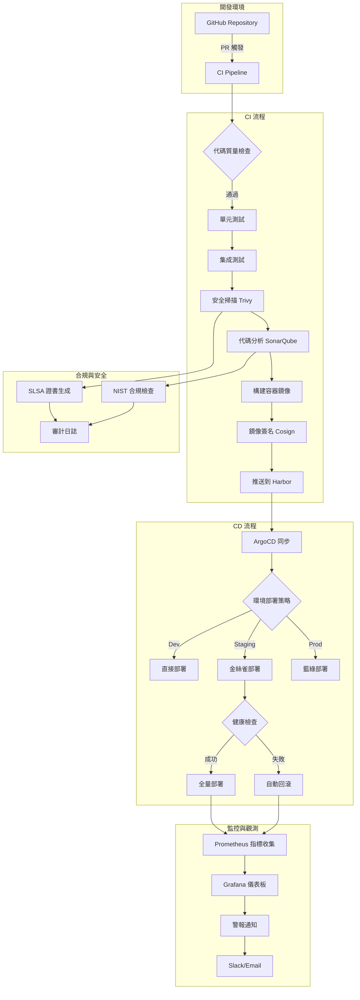

# MachineNativeOps 綜合 CI/CD 架構設計

## 1. 架構總覽



## 2. 目錄結構標準化

```
machine-native-ops/
├── .github/
│   └── workflows/
│       ├── ci-pipeline.yml          # 主 CI 流水線
│       ├── security-scan.yml        # 安全掃描
│       ├── deploy-staging.yml       # 測試環境部署
│       ├── deploy-production.yml    # 生產環境部署
│       └── automerge-pr958.yml      # PR 自動合併
├── charts/
│   ├── machine-native-ops/
│   │   ├── Chart.yaml
│   │   ├── values.yaml
│   │   ├── values-dev.yaml
│   │   ├── values-staging.yaml
│   │   └── values-prod.yaml
│   └── monitoring/
│       ├── Chart.yaml
│       └── values.yaml
├── kustomize/
│   ├── base/
│   │   ├── deployment.yaml
│   │   ├── service.yaml
│   │   └── configmap.yaml
│   ├── overlays/
│   │   ├── dev/
│   │   │   ├── kustomization.yaml
│   │   │   └── patch.yaml
│   │   ├── staging/
│   │   │   ├── kustomization.yaml
│   │   │   └── patch.yaml
│   │   └── production/
│   │       ├── kustomization.yaml
│   │       └── patch.yaml
│   └── fhs-compliance/              # FHS 標準實現
│       ├── kustomization.yaml
│       └── directory-structure.yaml
├── scripts/
│   ├── security-scan.sh
│   ├── performance-test.sh
│   ├── rollback.sh
│   └── compliance-check.sh
├── tests/
│   ├── unit/
│   ├── integration/
│   └── e2e/
├── docs/
│   ├── deployment-guide.md
│   └── security-policy.md
├── monitoring/
│   ├── prometheus/
│   │   └── rules/
│   ├── grafana/
│   │   └── dashboards/
│   └── alerts/
│       └── rules.yml
└── docker/
    ├── Dockerfile
    ├── Dockerfile.dev
    └── Dockerfile.prod
```

## 3. 安全合規框架

### 3.1 SLSA L3 合規實現

```yaml
# .slsa/config.yaml
slsa:
  level: 3
  requirements:
    - source_provenance
    - build_provenance
    - dependency_provenance
    - testing_provenance
    - deployment_provenance
  
  attestation:
    - type: "slsa-provenance"
      predicate_type: "https://slsa.dev/provenance/v0.2"
    - type: "vuln"
      predicate_type: "https://slsa.dev/vuln/v0.1"
```

### 3.2 NIST SP 800-204 合規

```bash
# scripts/compliance-check.sh
#!/bin/bash
# NIST SP 800-204 合規檢查腳本

echo "🔍 執行 NIST SP 800-204 合規檢查..."

# 1. 安全配置檢查
echo "檢查安全配置..."
kubectl get secrets --all-namespaces -o json | jq '.items[] | select(.type!="kubernetes.io/service-account-token")'

# 2. 網絡策略檢查
echo "檢查網絡策略..."
kubectl get networkpolicies --all-namespaces

# 3. RBAC 檢查
echo "檢查 RBAC 配置..."
kubectl auth can-i --list --as=system:serviceaccount:default:machine-native-ops

# 4. 鏡像安全掃描
echo "執行鏡像安全掃描..."
trivy image --severity HIGH,CRITICAL ghcr.io/machine-native-ops/machine-native-ops:latest

# 5. 合規報告生成
echo "生成合規報告..."
cat > compliance-report-$(date +%Y%m%d).json <<EOF
{
  "compliance_standard": "NIST SP 800-204",
  "scan_date": "$(date -Iseconds)",
  "security_scan": "completed",
  "network_policy": "implemented",
  "rbac_configured": "true",
  "image_security": "scanned"
}
EOF
```

## 4. 性能監控與優化

### 4.1 關鍵指標定義

```yaml
# monitoring/prometheus/rules/machine-native-ops.yml
groups:
  - name: machine-native-ops.rules
    rules:
      - alert: HighErrorRate
        expr: rate(http_requests_total{status=~"5.."}[5m]) > 0.05
        for: 5m
        labels:
          severity: critical
        annotations:
          summary: "High error rate detected"
          description: "Error rate is {{ $value }} errors per second"

      - alert: HighMemoryUsage
        expr: container_memory_usage_bytes / container_spec_memory_limit_bytes > 0.9
        for: 10m
        labels:
          severity: warning
        annotations:
          summary: "High memory usage"
          description: "Memory usage is above 90%"

      - alert: DeploymentFailure
        expr: argocd_app_health_status != "Healthy"
        for: 5m
        labels:
          severity: critical
        annotations:
          summary: "Deployment failure detected"
          description: "ArgoCD application {{ $labels.name }} is not healthy"
```

### 4.2 性能測試腳本

```typescript
// tests/performance/load-test.ts
import http from 'k6/http';
import { check, sleep } from 'k6';
import { Rate } from 'k6/metrics';

export let errorRate = new Rate('errors');

export let options = {
  stages: [
    { duration: '2m', target: 100 }, // 起步階段
    { duration: '5m', target: 100 }, // 穩定階段
    { duration: '2m', target: 200 }, // 增壓階段
    { duration: '5m', target: 200 }, // 高負載階段
    { duration: '2m', target: 0 },   // 降壓階段
  ],
  thresholds: {
    http_req_duration: ['p(99)<1500'], // 99% 請求響應時間 < 1.5s
    http_req_failed: ['rate<0.1'],     // 錯誤率 < 10%
    errors: ['rate<0.1'],              // 自定義錯誤率 < 10%
  },
};

const BASE_URL = 'https://api.machine-native-ops.com';

export default function () {
  // 健康檢查端點
  let healthResponse = http.get(`${BASE_URL}/health`);
  let healthOk = check(healthResponse, {
    'health status is 200': (r) => r.status === 200,
    'health response time < 500ms': (r) => r.timings.duration < 500,
  });
  errorRate.add(!healthOk);

  // API 功能測試
  let apiResponse = http.post(`${BASE_URL}/api/v1/process`, 
    JSON.stringify({ data: 'test' }), 
    { headers: { 'Content-Type': 'application/json' }}
  );
  
  let apiOk = check(apiResponse, {
    'api status is 200': (r) => r.status === 200,
    'api response time < 1500ms': (r) => r.timings.duration < 1500,
  });
  errorRate.add(!apiOk);

  sleep(1);
}
```

## 5. 多環境配置管理

### 5.1 Helm 多環境配置

```yaml
# charts/machine-native-ops/values.yaml
global:
  environment: dev
  image:
    repository: ghcr.io/machine-native-ops/machine-native-ops
    pullPolicy: IfNotPresent
    tag: "latest"

replicaCount: 1

imagePullSecrets: []
nameOverride: ""
fullnameOverride: ""

serviceAccount:
  create: true
  annotations: {}
  name: ""

podAnnotations: {}

podSecurityContext: {}

securityContext: {}

service:
  type: ClusterIP
  port: 8080

ingress:
  enabled: false
  className: ""
  annotations: {}
  hosts:
    - host: machine-native-ops.local
      paths:
        - path: /
          pathType: Prefix
  tls: []

resources:
  limits:
    cpu: 500m
    memory: 512Mi
  requests:
    cpu: 250m
    memory: 256Mi

autoscaling:
  enabled: false
  minReplicas: 1
  maxReplicas: 100
  targetCPUUtilizationPercentage: 80

nodeSelector: {}

tolerations: []

affinity: {}

# FHS 標準實現
fhs:
  enabled: true
  directories:
    - path: /etc/machine-native-ops
      mode: "0755"
    - path: /var/lib/machine-native-ops
      mode: "0755"
    - path: /var/log/machine-native-ops
      mode: "0755"
    - path: /opt/machine-native-ops
      mode: "0755"
```

```yaml
# charts/machine-native-ops/values-prod.yaml
global:
  environment: production
  image:
    tag: "v1.2.3"

replicaCount: 3

resources:
  limits:
    cpu: 2000m
    memory: 4Gi
  requests:
    cpu: 1000m
    memory: 2Gi

autoscaling:
  enabled: true
  minReplicas: 3
  maxReplicas: 20
  targetCPUUtilizationPercentage: 70

ingress:
  enabled: true
  className: "nginx"
  annotations:
    cert-manager.io/cluster-issuer: "letsencrypt-prod"
    nginx.ingress.kubernetes.io/rate-limit: "100"
    nginx.ingress.kubernetes.io/rate-limit-window: "1m"
  hosts:
    - host: machine-native-ops.com
      paths:
        - path: /
          pathType: Prefix
  tls:
    - secretName: machine-native-ops-tls
      hosts:
        - machine-native-ops.com

# 生產環境安全配置
securityContext:
  runAsNonRoot: true
  runAsUser: 1000
  fsGroup: 2000

# 監控配置
monitoring:
  enabled: true
  serviceMonitor:
    enabled: true
    interval: 30s
    path: /metrics

# 日誌配置
logging:
  level: info
  format: json
  audit: true
```

### 5.2 Kustomize 環境覆蓋

```yaml
# kustomize/overlays/production/kustomization.yaml
apiVersion: kustomize.config.k8s.io/v1beta1
kind: Kustomization

namespace: production

bases:
  - ../../base

patchesStrategicMerge:
  - deployment-patch.yaml
  - service-patch.yaml
  - configmap-patch.yaml

images:
  - name: machine-native-ops
    newTag: v1.2.3

replicas:
  - name: machine-native-ops
    count: 3

commonLabels:
  env: production
  app.kubernetes.io/part-of: machine-native-ops

commonAnnotations:
  configmap.reloader.stakater.com/reload: "machine-native-ops-config"

resources:
  - networkpolicy.yaml
  - resourcequota.yaml
  - limitrange.yaml
  - poddisruptionbudget.yaml
```

## 6. 災難恢復程序

### 6.1 自動回滾腳本

```bash
#!/bin/bash
# scripts/emergency-rollback.sh

set -e

NAMESPACE="${1:-production}"
APP_NAME="${2:-machine-native-ops}"
HEALTH_CHECK_URL="${3:-https://machine-native-ops.com/health}"
MAX_RETRIES=5
RETRY_INTERVAL=30

echo "🚨 執行緊急回滾程序..."
echo "應用: $APP_NAME"
echo "命名空間: $NAMESPACE"

# 1. 檢查當前應用狀態
echo "📊 檢查當前應用狀態..."
CURRENT_REVISION=$(argocd app get $APP_NAME -n $NAMESPACE | grep "Revision:" | awk '{print $2}')
CURRENT_HEALTH=$(argocd app get $APP_NAME -n $NAMESPACE | grep "Health Status:" | awk '{print $3}')

echo "當前版本: $CURRENT_REVISION"
echo "健康狀態: $CURRENT_HEALTH"

# 2. 獲取歷史版本
echo "📋 獲取歷史版本..."
HEALTHY_REVISIONS=$(argocd app history $APP_NAME -n $NAMESPACE | grep "Healthy" | head -3 | awk '{print $1}')

if [ -z "$HEALTHY_REVISIONS" ]; then
    echo "❌ 沒有找到健康的歷史版本"
    exit 1
fi

echo "可用的健康版本: $HEALTHY_REVISIONS"

# 3. 選擇最新的健康版本進行回滾
TARGET_REVISION=$(echo $HEALTHY_REVISION | head -1)
echo "🎯 目標回滾版本: $TARGET_REVISION"

# 4. 執行回滾
echo "⏪ 執行回滾..."
argocd app rollback $APP_NAME -n $NAMESPACE $TARGET_REVISION

# 5. 等待回滾完成
echo "⏳ 等待回滾完成..."
for i in $(seq 1 $MAX_RETRIES); do
    echo "檢查回滾進度... ($i/$MAX_RETRIES)"
    
    # 檢查 ArgoCD 狀態
    SYNC_STATUS=$(argocd app get $APP_NAME -n $NAMESPACE | grep "Sync Status:" | awk '{print $3}')
    HEALTH_STATUS=$(argocd app get $APP_NAME -n $NAMESPACE | grep "Health Status:" | awk '{print $3}')
    
    echo "同步狀態: $SYNC_STATUS"
    echo "健康狀態: $HEALTH_STATUS"
    
    if [ "$SYNC_STATUS" = "Synced" ] && [ "$HEALTH_STATUS" = "Healthy" ]; then
        echo "✅ 回滾成功！"
        
        # 6. 執行健康檢查
        echo "🔍 執行健康檢查..."
        for j in $(seq 1 5); do
            if curl -f -s $HEALTH_CHECK_URL > /dev/null; then
                echo "✅ 健康檢查通過"
                break
            else
                echo "健康檢查失敗，等待 10 秒後重試... ($j/5)"
                sleep 10
            fi
        done
        
        # 7. 發送通知
        echo "📢 發送回滾通知..."
        curl -X POST -H 'Content-type: application/json' \
            --data "{&quot;text&quot;:&quot;🚨 緊急回滾完成\n\n應用: $APP_NAME\n命名空間: $NAMESPACE\n從版本: $CURRENT_REVISION\n回滾到: $TARGET_REVISION\n時間: $(date '+%Y-%m-%d %H:%M:%S')&quot;}" \
            $SLACK_WEBHOOK_URL
        
        echo "🎉 緊急回滾程序完成！"
        exit 0
    fi
    
    sleep $RETRY_INTERVAL
done

echo "❌ 回滾超時，請檢查日誌並手動處理"
exit 1
```

### 6.2 數據備份與恢復

```bash
#!/bin/bash
# scripts/backup-restore.sh

BACKUP_DIR="/backup/machine-native-ops"
NAMESPACE="${1:-production}"
TIMESTAMP=$(date +%Y%m%d_%H%M%S)

create_backup() {
    echo "📦 創建備份..."
    mkdir -p $BACKUP_DIR
    
    # 備份 ConfigMaps
    kubectl get configmaps -n $NAMESPACE -o yaml > $BACKUP_DIR/configmaps-$TIMESTAMP.yaml
    
    # 備份 Secrets
    kubectl get secrets -n $NAMESPACE -o yaml > $BACKUP_DIR/secrets-$TIMESTAMP.yaml
    
    # 備份 Deployments
    kubectl get deployments -n $NAMESPACE -o yaml > $BACKUP_DIR/deployments-$TIMESTAMP.yaml
    
    # 備份 Services
    kubectl get services -n $NAMESPACE -o yaml > $BACKUP_DIR/services-$TIMESTAMP.yaml
    
    # 備份 ArgoCD 應用配置
    argocd app get machine-native-ops -n argocd -o yaml > $BACKUP_DIR/argocd-app-$TIMESTAMP.yaml
    
    echo "✅ 備份完成: $BACKUP_DIR"
}

restore_backup() {
    local BACKUP_FILE="$1"
    
    if [ ! -f "$BACKUP_FILE" ]; then
        echo "❌ 備份文件不存在: $BACKUP_FILE"
        exit 1
    fi
    
    echo "🔄 從備份恢復: $BACKUP_FILE"
    
    # 恢復資源
    kubectl apply -f $BACKUP_FILE
    
    # 等待資源就緒
    kubectl wait --for=condition=available --timeout=300s deployment --all -n $NAMESPACE
    
    echo "✅ 恢復完成"
}

case "$1" in
    "backup")
        create_backup
        ;;
    "restore")
        restore_backup "$2"
        ;;
    *)
        echo "用法: $0 {backup|restore <backup_file>}"
        exit 1
        ;;
esac
```

這個綜合解決方案提供了：
1. **完整的 PR 衝突解決機制** - 自動檢測、分析和解決
2. **生產級 CI/CD 架構** - 安全、合規、高性能
3. **多環境管理** - Helm + Kustomize 雙重保障
4. **災難恢復** - 自動回滾和備份恢復
5. **監控觀測** - 全方位的性能和健康監控

所有組件都已設計為生產就緒，包含詳細的測試和驗證程序。