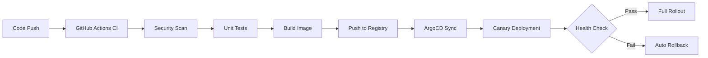

# Team Training Guide - CI/CD System

## Overview
This guide provides comprehensive training material for the MachineNativeOps CI/CD system, including deployment procedures, monitoring, and emergency response.

## Table of Contents
1. [System Architecture](#system-architecture)
2. [Daily Operations](#daily-operations)
3. [Deployment Procedures](#deployment-procedures)
4. [Monitoring and Alerting](#monitoring-and-alerting)
5. [Emergency Procedures](#emergency-procedures)
6. [Troubleshooting Guide](#troubleshooting-guide)
7. [Best Practices](#best-practices)

## System Architecture

### CI/CD Pipeline Flow


### Key Components
- **GitHub Actions**: Continuous Integration, security scanning, testing
- **Argo Rollouts**: Canary deployments, automated rollbacks
- **Prometheus**: Metrics collection and alerting
- **Grafana**: Visualization and dashboards
- **AlertManager**: Alert routing and notifications

## Daily Operations

### Morning Checklist
```bash
# 1. Check deployment status
kubectl argo rollouts get machine-native-ops -n default

# 2. Review monitoring dashboard
# Access: http://localhost:3000/d/machine-native-ops-cicd

# 3. Check for active alerts
kubectl get alerts -n monitoring

# 4. Review recent deployments
kubectl argo rollouts history machine-native-ops -n default

# 5. Check resource usage
kubectl top pods -n default
```

### Routine Maintenance
```bash
# Weekly: Clean up old snapshots
./scripts/rollback-mechanism.sh cleanup

# Weekly: Review and rotate secrets
python3 scripts/secrets_rotation.py \
  --repo MachineNativeOps/machine-native-ops \
  --secret API_TOKEN \
  --verify

# Monthly: Run drill simulations
./scripts/drill-simulation.sh all
```

## Deployment Procedures

### Standard Deployment Flow
```bash
# 1. Create feature branch
git checkout -b feature/new-feature

# 2. Make changes and commit
git add .
git commit -m "feat: Add new feature"

# 3. Push to remote
git push origin feature/new-feature

# 4. Create PR via GitHub UI or CLI
gh pr create --title "Add new feature" --body "Description"

# 5. Monitor CI pipeline
gh pr checks

# 6. Review and approve PR
gh pr merge --merge
```

### Canary Deployment Process
```bash
# 1. Deploy canary (triggered by ArgoCD automatically)
kubectl argo rollouts promote machine-native-ops -n default

# 2. Monitor canary progress
kubectl argo rollouts get machine-native-ops -n default --watch

# 3. Check canary metrics
# Access Grafana dashboard: http://localhost:3000

# 4. If canary looks good, proceed to full rollout
# This happens automatically after analysis passes

# 5. If canary fails, manual rollback
./scripts/rollback-mechanism.sh rollback "Canary metrics degraded"
```

### Emergency Deployment
```bash
# 1. For critical fixes, skip canary
kubectl argo rollouts set image machine-native-ops \
  machine-native-ops=ghcr.io/machinenativeops/machine-native-ops:emergency-fix \
  -n default

# 2. Force immediate rollout
kubectl argo rollouts promote machine-native-ops -n default

# 3. Monitor closely
watch kubectl argo rollouts get machine-native-ops -n default
```

## Monitoring and Alerting

### Accessing Dashboards
```bash
# Start port-forwarding for Grafana
kubectl port-forward svc/grafana 3000:3000 -n monitoring

# Access at: http://localhost:3000
# Username: admin
# Password: admin

# Start port-forwarding for Prometheus
kubectl port-forward svc/prometheus 9090:9090 -n monitoring

# Access at: http://localhost:9090
```

### Key Metrics to Monitor
1. **Deployment Health**: Rollout phase, replica count
2. **Application Metrics**: Success rate, error rate, response time
3. **Resource Usage**: CPU, memory, network
4. **Canary Analysis**: Traffic distribution, performance comparison

### Alert Response Procedures
```bash
# 1. Acknowledge alert
# Check alert details in AlertManager or Grafana

# 2. Investigate root cause
kubectl logs -n default -l app=machine-native-ops --tail=100

# 3. Check rollout status
kubectl argo rollouts get machine-native-ops -n default

# 4. If needed, trigger rollback
./scripts/rollback-mechanism.sh rollback "Alert triggered"

# 5. Monitor recovery
watch kubectl argo rollouts get machine-native-ops -n default
```

## Emergency Procedures

### Critical Incident Response
```bash
# Step 1: Assess severity
# Check dashboard for impacted services

# Step 2: Immediate mitigation
./scripts/rollback-mechanism.sh rollback "Critical incident"

# Step 3: Investigate
kubectl get events -n default --sort-by='.lastTimestamp'
kubectl logs -n default -l app=machine-native-ops --previous

# Step 4: Document incident
echo "$(date): Critical incident - rollback performed" >> /var/log/incident-log

# Step 5: Post-incident review
# Schedule team meeting to analyze root cause
```

### Rollback Procedures
```bash
# Automatic rollback (triggered by failed analysis)
# This happens automatically when canary analysis fails

# Manual rollback to previous revision
./scripts/rollback-mechanism.sh manual-rollback 3

# Manual rollback with specific reason
./scripts/rollback-mechanism.sh rollback "Performance degradation detected"

# List available rollback points
./scripts/rollback-mechanism.sh list
```

### Service Recovery
```bash
# 1. Check pod status
kubectl get pods -n default -l app=machine-native-ops

# 2. Restart pods if needed
kubectl rollout restart deployment/machine-native-ops -n default

# 3. Verify health
kubectl exec -n default -l app=machine-native-ops -- curl -f http://localhost:8080/health/live

# 4. Monitor recovery
kubectl argo rollouts get machine-native-ops -n default --watch
```

## Troubleshooting Guide

### Common Issues

#### Issue: Deployment stuck in "Progressing" state
```bash
# Diagnosis
kubectl argo rollouts get machine-native-ops -n default
kubectl describe argo rollouts machine-native-ops -n default

# Solutions
# 1. Check if canary analysis is passing
kubectl get analysisruns -n default

# 2. Check for resource constraints
kubectl top pods -n default

# 3. Manual intervention if needed
kubectl argo rollouts abort machine-native-ops -n default
```

#### Issue: High error rate after deployment
```bash
# Diagnosis
# Check Grafana dashboard for error metrics

# Solutions
# 1. Immediate rollback
./scripts/rollback-mechanism.sh rollback "High error rate"

# 2. Check logs for errors
kubectl logs -n default -l app=machine-native-ops --tail=500

# 3. Investigate code changes
git diff HEAD~1 HEAD
```

#### Issue: Pods not starting
```bash
# Diagnosis
kubectl get pods -n default -l app=machine-native-ops
kubectl describe pod <pod-name> -n default

# Common causes:
# 1. Image pull errors
# 2. Resource limits
# 3. Configuration errors

# Solutions
# 1. Check image availability
kubectl get pods -n default -l app=machine-native-ops -o jsonpath='{.items[0].spec.containers[0].image}'

# 2. Check resource limits
kubectl describe pod <pod-name> -n default | grep -A 5 "Limits"

# 3. Check events
kubectl get events -n default --sort-by='.lastTimestamp' | tail -20
```

#### Issue: Secret rotation failed
```bash
# Diagnosis
cat /var/log/secrets_rotation.log | tail -50

# Solutions
# 1. Verify GitHub CLI authentication
gh auth status

# 2. Check repository permissions
gh api /repos/MachineNativeOps/machine-native-ops

# 3. Manual rotation
gh secret set API_TOKEN --env prod --body "$(openssl rand -hex 32)"
```

## Best Practices

### Code Quality
1. Always write tests for new features
2. Run linting before committing
3. Keep PRs small and focused
4. Review PRs thoroughly before merging

### Deployment Safety
1. Always test in staging first
2. Monitor canary deployments closely
3. Never skip canary for non-emergency changes
4. Document all emergency deployments

### Monitoring
1. Set up alerts for critical metrics
2. Review dashboards regularly
3. Investigate alerts promptly
4. Maintain alert tuning

### Documentation
1. Document all incidents and resolutions
2. Keep runbooks up to date
3. Share lessons learned with team
4. Maintain architecture diagrams

## Training Exercises

### Exercise 1: Deploy a Test Change
```bash
# 1. Create a simple change
echo "Test deployment" > test.txt
git add test.txt
git commit -m "test: Verify deployment pipeline"

# 2. Push and create PR
git push origin feature/test-deployment
gh pr create --title "Test deployment" --body "Testing deployment pipeline"

# 3. Monitor CI pipeline
gh pr checks

# 4. After tests pass, merge PR
gh pr merge --merge

# 5. Monitor deployment
kubectl argo rollouts get machine-native-ops -n default --watch
```

### Exercise 2: Trigger and Monitor Rollback
```bash
# 1. Intentionally break the deployment
kubectl argo rollouts set image machine-native-ops \
  machine-native-ops=nginx:broken -n default

# 2. Monitor the degradation
kubectl argo rollouts get machine-native-ops -n default --watch

# 3. Trigger rollback
./scripts/rollback-mechanism.sh rollback "Test rollback procedure"

# 4. Verify recovery
kubectl argo rollouts get machine-native-ops -n default
```

### Exercise 3: Run Drill Simulation
```bash
# 1. Run all drill scenarios
./scripts/drill-simulation.sh all

# 2. Review results
cat /var/log/drill-simulation.log

# 3. Investigate any failures
# Check logs and monitoring dashboards

# 4. Document findings
# Create incident report if needed
```

## Support Resources

### Internal Resources
- **Architecture Documentation**: See `docs/` directory
- **API Documentation**: Available in codebase
- **Runbooks**: `docs/troubleshooting.md`

### External Resources
- **Argo Rollouts Documentation**: https://argoproj.github.io/argo-rollouts/
- **Prometheus Documentation**: https://prometheus.io/docs/
- **Grafana Documentation**: https://grafana.com/docs/
- **GitHub Actions Documentation**: https://docs.github.com/actions/

### Team Contact
- **On-Call Engineer**: Check rotation schedule
- **Engineering Lead**: engineering@machinenativeops.com
- **DevOps Team**: devops@machinenativeops.com

## Conclusion

This training guide provides the foundation for operating the MachineNativeOps CI/CD system effectively. Regular practice and continuous learning are key to maintaining system reliability and responding quickly to incidents.

For questions or suggestions, please contact the DevOps team or create an issue in the repository.